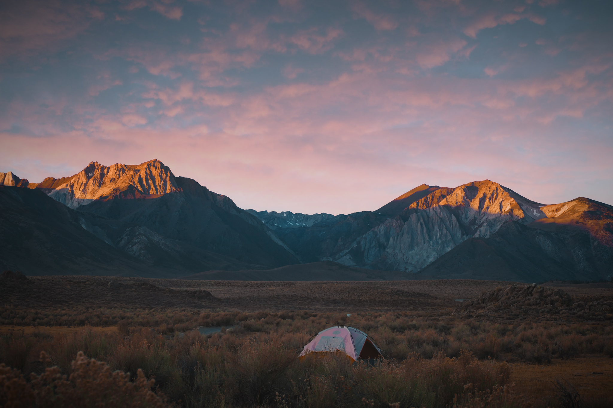
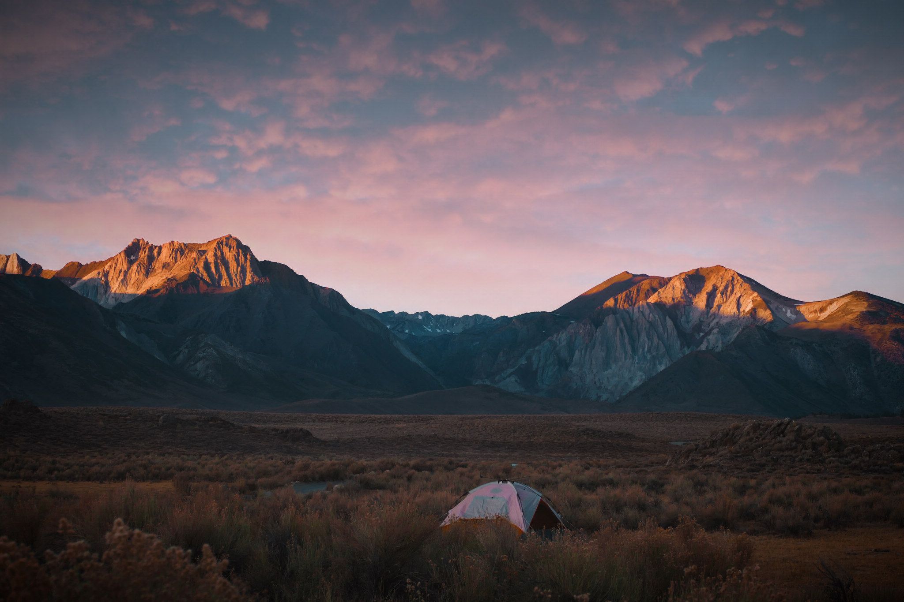

# high-fidelity-generative-compression
Pytorch implementation of the paper ["High-Fidelity Generative Image Compression" by Mentzer et. al.](https://hific.github.io/)

## Warning
This is a preliminary version. There may be sharp edges.

## Details
This repository defines a model for learnable image compression capable of compressing images of arbitrary size and resolution. There are three main components to this model, as described in the original paper:

1. An autoencoding architecture defining a nonlinear transform to latent space. This is used in place of the linear transforms used by traditional image codecs.
2. A hierarchical (two-level in this case) entropy model over the quantized latent representation enabling lossless compression through standard entropy coding.
3. A generator-discriminator component that encourages the decoder/generator component to yield realistic reconstructions.

The model is then trained end-to-end by optimization of a modified rate-distortion Lagrangian. Loosely, the model can be thought of as 'amortizing' the storage requirements for an generic input image through training a learnable compression/decompression scheme. The method is further described in the original paper [[0](https://arxiv.org/abs/2006.09965)]. The model is capable of yielding perceptually similar reconstructions to the input that tend to be more visually pleasing than standard image codecs which operate at comparable or higher bitrates. 

## Examples
```
Original, 8.05 bpp / 2747 kB
```

```
HIFIC, 0.188 bpp / 64.1 kB
```

```
JPG, 0.264 bpp / 90.1 kB
```


The image shown is an out-of-sample instance from the CLIC-2020 dataset. The HIFIC image is obtained by reconstruction via the learned model. The JPG image is obtained by the `imagemagick` command `mogrify -format jpg -quality 42 camp_original.png`. Despite using around 1.5x the bitrate, the JPG image exhibits visible compression artifacts which are absent in the HIFIC-generated image.

All images are losslessly compressed to PNG format for viewing. Images and other examples are stored under `assets/comparison`. Note that the learned model was not adapted in any way for evaluation on this image.

## Note
The generator is trained to achieve realistic and not exact reconstruction. It may synthesize certain portions of a given image to remove artifacts associated with lossy compression. Therefore, in theory **images which are compressed and decoded may be arbitrarily different from the input**. This precludes usage for sensitive applications. An important caveat from the authors is reproduced here: 

> "_Therefore, we emphasize that our method is not suitable for sensitive image contents, such as, e.g., storing medical images, or important documents._" 

## Usage
* Install Pytorch nightly and dependencies from [https://pytorch.org/](https://pytorch.org/). Then install other requirements.
```
pip install -r requirements.txt
```
* Download a large (> 100,000) dataset of reasonably diverse color images. We found that using 1-2 training divisions of the [OpenImages](https://storage.googleapis.com/openimages/web/index.html) dataset was able to produce satisfactory results on arbitrary images. Choosing a particular source domain (e.g. Cityscapes) may increase compression performance within that domain. Add the dataset path under the `DatasetPaths` class in `default_config.py`.
* Clone this repository, `cd` in and view the default arguments/command line options.
```
git clone https://github.com/Justin-Tan/high-fidelity-generative-compression.git
cd high-fidelity-generative-compression

vim default_config.py
python3 train.py -h
```

To check if your setup is working, run `python3 -m src.model` in root.

### Training
* For best results, as described in the paper, train an initial base model using the rate-distortion loss only, together with the hyperprior model, e.g. to target low bitrates:
```
python3 train.py --model_type compression --regime low --n_steps 1e6
```

* Then use the checkpoint of the trained base model to 'warmstart' the GAN architecture. Training the generator and discriminator from scratch was found to result in unstable training, but YMMV.
```
python3 train.py --model_type compression_gan --regime low --n_steps 1e6 --warmstart --ckpt path/to/base/checkpoint
```
* Training after the warmstart for 2e5 steps using a batch size of 16 was sufficient to get reasonable results at sub-0.2 `bpp` per image, on average, using the default config in the `low` regime. You can change regimes to `med` or `high` to tradeoff perceptual quality for increased bitrate.

* If you get out-of-memory errors, try, in decreasing order of priority:
    * Decreasing the batch size (default 16).
    * Decreasing the number of channels of the latent representation (`latent_channels`, default 220). You may be able to reduce this quite aggressively as the network is highly overparameterized. Many values of the latent representation are near-deterministic. 
    * Reducing the number of residual blocks in the generator (`n_residual_blocks`, default 7, the original paper used 9).
    * Training on smaller crops (`crop_size`, default `256 x 256`).

* Logs for each experiment are automatically created and periodically saved under `experiments/` with the appropriate name/timestamp. A subset of metrics can be visualized via `tensorboard`:

```
tensorboard --logdir experiments/my_experiment/tensorboard
```

### Compression
* To obtain a _theoretical_ measure of the bitrate under some trained model, run `compress.py`. This will report the bits-per-pixel attainable by the compressed representation (`bpp`), some other fun metrics, and perform a forward pass through the model to obtain the reconstructed image (as a PNG). This model will work with images of arbitrary sizes and resolution (provided you don't run out of memory). The following command will work with JPG and PNG (without alpha channels):
```
python3 compress.py -i path/to/image/dir -ckpt path/to/trained/model
```
* A pretrained model using the OpenImages dataset can be found here: [Drive link]. This model was trained for 2e5 warmup steps and 2e5 steps with the full generative loss. To use this, download the model and point the `-ckpt` argument in the command above to the corresponding path. 

* The reported `bpp` is the theoretical bitrate required to losslessly store the quantized latent representation of an image as determined by the learned probability model provided by the hyperprior using some entropy coding algorithm. Comparing this (not the size of the reconstruction) against the original size of the image will give you an idea of the reduction in memory footprint. This repository does not currently support actual compression to a bitstring ([TensorFlow Compression](https://github.com/tensorflow/compression) does this well). We're working on an ANS entropy coder to support this in the future.

### Notes
* The "size" of the compressed image as reported in `bpp` does not account for the size of the model required to decode the compressed format.
* The total size of the model (using the original architecture) is around 737 MB. Forward pass time should scale sublinearly provided everything fits in memory. A complete forward pass using a batch of 10 `256 x 256` images takes around 45s on a 2.8 GHz Intel Core i7.
* You may get an OOM error when compressing images which are too large (`>~ 4000 x 4000`). It's possible to get around this by applying the network to evenly sized crops of the input image whose forward pass will fit in memory. We're working on a fix to automatically support this. 

### Contributing
All content in this repository is licensed under the Apache-2.0 license. Feel free to submit any corrections or suggestions as issues.

### Acknowledgements
* The code under `hific/perceptual_similarity/` implementing the perceptual distortion loss is modified from the [Perceptual Similarity repository](https://github.com/richzhang/PerceptualSimilarity).

### Authors
* Grace Han
* Justin Tan

### References
The following additional papers were useful to understand implementation details.
0. Fabian Mentzer, George Toderici, Michael Tschannen, Eirikur Agustsson. High-Fidelity Generative Image Compression. [arXiv:2006.09965 (2020)](https://arxiv.org/abs/2006.09965).
1. Johannes Ballé, David Minnen, Saurabh Singh, Sung Jin Hwang, Nick Johnston. Variational image compression with a scale hyperprior. [arXiv:1802.01436 (2018)](https://arxiv.org/abs/1802.01436).
2. David Minnen, Johannes Ballé, George Toderici. Joint Autoregressive and Hierarchical Priors for Learned Image Compression. [arXiv 1809.02736 (2018)](https://arxiv.org/abs/1809.02736).
3. Johannes Ballé, Valero Laparra, Eero P. Simoncelli. End-to-end optimization of nonlinear transform codes for perceptual quality. [arXiv 1607.05006 (2016)](https://arxiv.org/abs/1607.05006).
4. Fabian Mentzer, Eirikur Agustsson, Michael Tschannen, Radu Timofte, Luc Van Gool. Practical Full Resolution Learned Lossless Image Compression. [arXiv 1811.12817 (2018)](https://arxiv.org/abs/1811.12817).

## Citation
This is not the official implementation. Please cite the [original paper](https://arxiv.org/abs/2006.09965) if you use their work.
```
@article{mentzer2020high,
  title={High-Fidelity Generative Image Compression},
  author={Mentzer, Fabian and Toderici, George and Tschannen, Michael and Agustsson, Eirikur},
  journal={arXiv preprint arXiv:2006.09965},
  year={2020}
}
```
