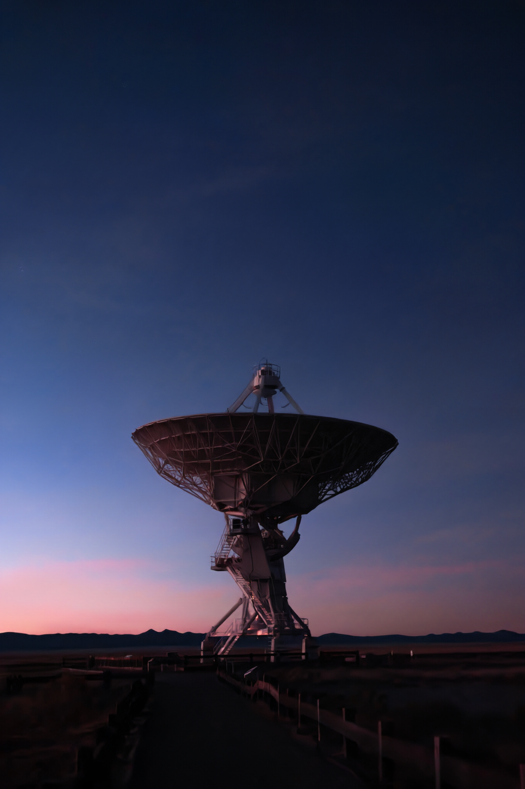
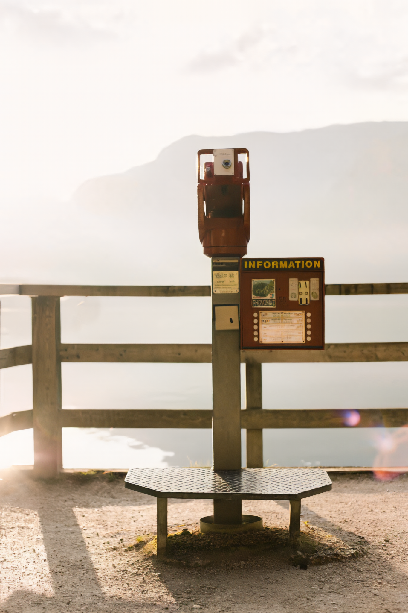
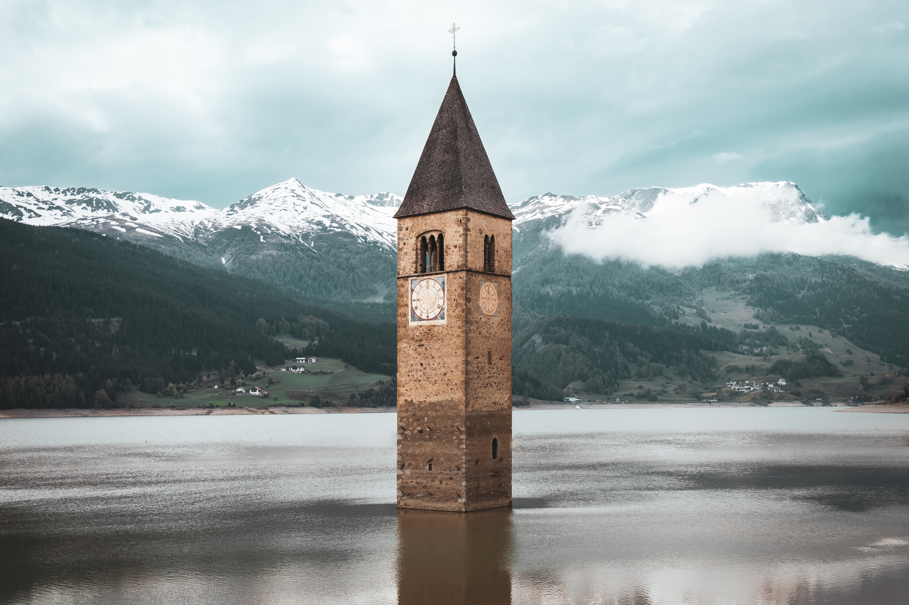
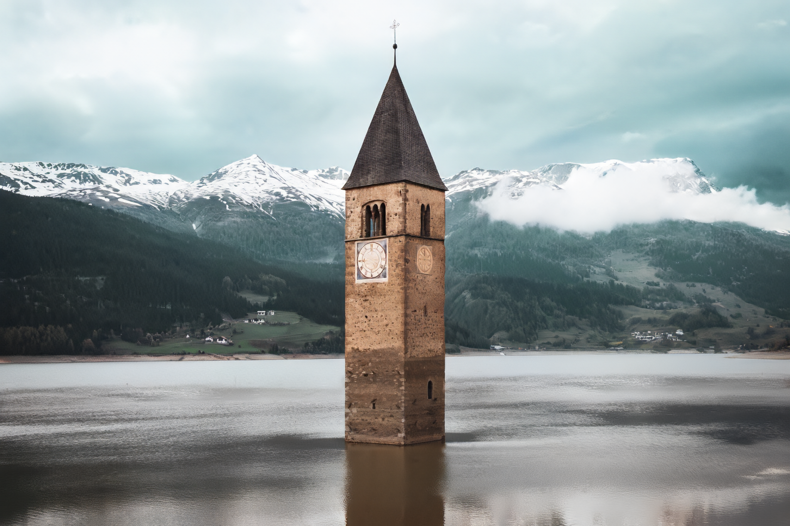

The images below were generated using the `HIFIC-low` model. You can generate the reconstructions by downloading the model weights and using the following command. The bitrate is reported in bits-per-pixel (`bpp`) of the compressed representation.

[](https://colab.research.google.com/github/Justin-Tan/high-fidelity-generative-compression/blob/hific_demo/assets/HiFIC_torch_colab_demo.ipynb)

```bash
python3 compress.py -i /path/to/input/images --ckpt /path/to/model/checkpoint --reconstruct
```

Images are losslessly saved to PNG for viewing. More examples can be found in [this shared drive.](https://drive.google.com/drive/folders/1lH1pTmekC1jL-gPi1fhEDuyjhfe5x6WG).

Original | Reconstruction
:-------------------------:|:-------------------------:
 | 

```python
Original: 13.2 bpp | HIFIC: 0.168 bpp
```


Original | Reconstruction
:-------------------------:|:-------------------------:
 | 

```python
Original: 4.31 bpp | HIFIC: 0.039 bpp
```

Original | Reconstruction
:-------------------------:|:-------------------------:
 | 

```python
Original: 5.61 bpp | HIFIC: 0.083 bpp
```

Original | Reconstruction
:-------------------------:|:-------------------------:
 | 

```python
Original: 9.93 bpp | HIFIC: 0.090 bpp
```
